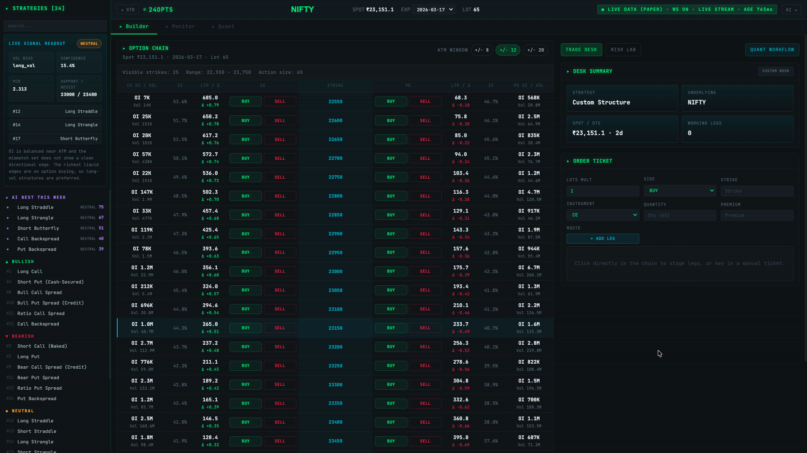
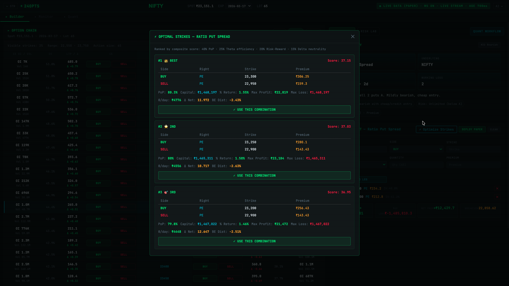
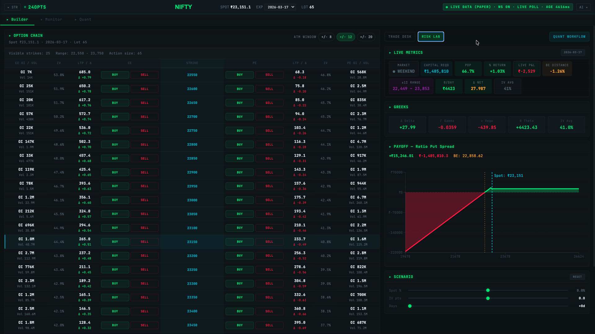
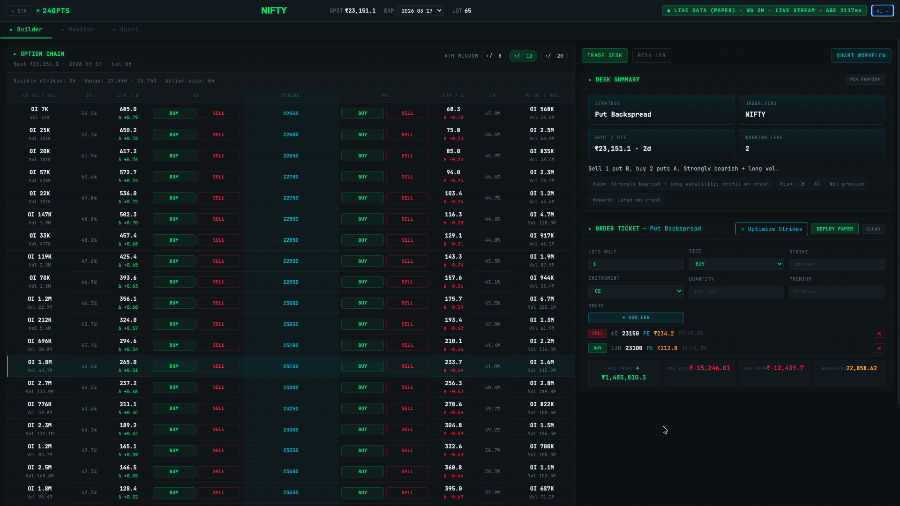
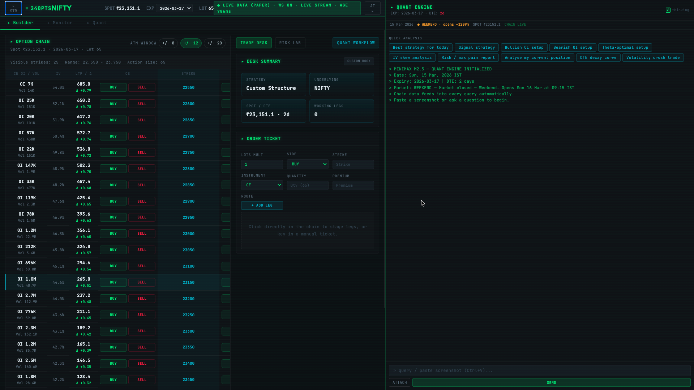

# 24 Options — Quantum AI Strategy Studio


**The professional-grade options trading engine for NIFTY / BANKNIFTY.** 
24 Options combines a high-fidelity quantitative core with an embedded AI Options Engineer to automate position building, risk calculation, and strike optimization.
---

## Visual Overview

### Platform Gallery
| View | Description |
| :--- | :--- |
|  | **AI Strategy Catalog**: Real-time signal readout with 24 pre-built templates and AI-ranked confidence scores. |
|  | **Intelligent Optimizer**: Multi-objective root-finding to identify the best PoP/Risk-Reward strike combinations. |
|  | **Quant Risk Lab**: Interactive Greek aggregation ($\Delta, \Gamma, \Theta, \nu$) and BSM-calculated profit/loss curves. |
|  | **Order Ticket & Staging**: Professional multi-leg ticketing area with real-time net capital and margin requirements. |
|  | **Embedded AI Copilot**: Deep reasoning ("Thinking" mode) analyzing market regimes and providing trade justifications. |
|  | **Portfolio Audit**: AI-driven analysis of net portfolio delta and automated rebalancing recommendations. |
|  | **Regime Classification**: AI analysis of Historical vs. Implied Volatility to detect edge-case market environments. |

---

## The AI Options Engineer
Unlike basic chatbots, the AI in **24 Options** is a senior quantitative engineer embedded in your terminal. It doesn't just talk; it **builds and optimizes**.

### AI Copilot Architecture
The AI is not a chatbot — it is a **strategy scoring engine**:

1. **Chain Intake**: Live option chain fetched from Fyers → Greeks + IV computed for all strikes via native BSM engine.
2. **Regime Classification**: Market regime classified (Trending/Sideways/High-IV) using ATM IV vs Historical Volatility ratios.
3. **Strategy Scoring**: All 24 strategies scored against current market conditions for Probability of Profit (PoP).
4. **Structured Reasoning**: LLM (Minimax M2.5) receives structured JSON context — not raw text snippets.
5. **Leg Synthesis**: Returns ranked strategy list + recommended strikes + position sizing + risk summary.
6. **Natural Language Interface**: "Build me a low-risk bearish trade for BNF expiry Thursday" → Parsed → Bear Put Spread → optimal OTM strikes auto-selected → Legs deployed.

---

## Quant Engine
The pricing core implements the **Black-Scholes-Merton** model from scratch for high-fidelity calculations:

- **Theoretical Price**: $C = S \cdot N(d_1) - K \cdot e^{-rT} \cdot N(d_2)$
- **Implied Volatility**: Newton-Raphson solver converging to market price with high precision.
- **Real-time Greeks Computed**:
  - **Delta ($\partial V/\partial S$ )**: Your directional exposure.
  - **Gamma ($\partial^2 V/\partial S^2$)**: Your convexity/acceleration risk.
  - **Theta ($\partial V/\partial t$)**: Daily time decay in ₹.
  - **Vega ($\partial V/\partial \sigma$)**: Sensitivity to a 1% move in implied volatility.

Portfolio-level Greeks are aggregated across all open legs, enabling real-time net exposure monitoring and automated delta-neutral balancing.

### Under the Hood: BSM Implementation
The engine is optimized for accuracy and speed, moving beyond simple intrinsic approximations:
- **Numerical Precision**: Uses `scipy.stats.norm` for high-precision Cumulative Distribution Function (CDF) calculations.
- **IV Solver**: Employs **Brent's Method** (`scipy.optimize.brentq`) for a robust root-finding solver that converges to the market-implied volatility with zero drift.
- **Dividend Integration**: Inferred dividend yields (e.g., 1.2% for NIFTY50) are integrated into the $d_1$ and $d_2$ parameters for professional-grade pricing.
- **Analytical Greeks**: Derived using exact closed-form solutions for Delta, Gamma, Theta, Vega, and Rho, rather than numerical finite-difference estimation.

---

## Risk Manager
Configurable hard limits are enforced by the engine before any order hits the broker:

- **Max Portfolio Delta**: Cap total directional exposure (e.g., $\pm 50$ delta).
- **Max Theta Bleed**: Enforce a limit on daily time decay costs.
- **Capital Risk %**: Max loss per trade as a percentage of total allocated capital.
- **Vega Cap**: Restrict exposure during high-IV events to prevent volatility crush.
- **Auto-Position Sizing**: Quantity is automatically calculated as: `Capital × Risk% ÷ Max Loss per contract`.

---

## 24 Pre-Built Canonical Strategies
| Bullish | Bearish | Neutral | Volatility / Hedges |
| :--- | :--- | :--- | :--- |
| Long Call | Long Put | Iron Condor | Long Straddle |
| Short Put (Cash-Secured) | Short Call (Naked) | Iron Butterfly | Long Strangle |
| Bull Call Spread | Bear Put Spread | Short Straddle | Covered Call |
| Bull Put Spread (Credit) | Bear Call Spread (Credit) | Short Strangle | Protective Put |
| Ratio Call Spread | Ratio Put Spread | Long Call Butterfly | Collar |
| Call Backspread | Put Backspread | Long Call Condor | Short Butterfly |

---

## Prerequisites
- **Python**: 3.10+
- **Node.js**: 18+
- **Broker**: Fyers API v3 Account
- **AI**: OpenRouter API Key

---

## Why 24Options?
| Feature | Sensibull / Opstra | 24Options |
| :--- | :---: | :---: |
| Self-Hosted | NO | YES |
| AI strategy scoring | NO | YES |
| Custom Greeks limits | NO | YES |
| Open-source & hackable | NO | YES |
| One-click Fyers deploy | NO | YES |

---

## Configuration
Create a `.env` file based on `.env.example`:

```env
# Fyers API (for live data + execution)
FYERS_CLIENT_ID=your_app_id
FYERS_SECRET=your_secret
FYERS_REDIRECT_URI=http://localhost:8000/auth/callback

# AI Copilot
OPENROUTER_API_KEY=your_key
AI_MODEL=minimax/minimax-m2.5

# Risk Settings
MAX_CAPITAL=100000        # ₹ Capital allocated
MAX_RISK_PER_TRADE=0.02   # 2% per trade
PAPER_MODE=true           # Set to false for live execution
```

---

## Quick Start
```bash
git clone https://github.com/Vikkrantpol/24Options.git
cd 24Options
./run.sh
```
Open **http://localhost:8000**. The launcher handles dependencies and environment setup automatically.

---

## Author
**Vikkrant Pol** — IIT Goa
[LinkedIn](https://www.linkedin.com/in/vikkrantpol) | [GitHub](https://github.com/Vikkrantpol)

---

## License
MIT License.

> [!CAUTION]
> **DISCLAIMER: USE AT YOUR OWN RISK.**
> Algorithmic trading involves substantial risk of loss. The AI recommendations and automated positions provided by this software are for educational and studio purposes only. Always validate setups in Paper Trading mode before live deployment.
